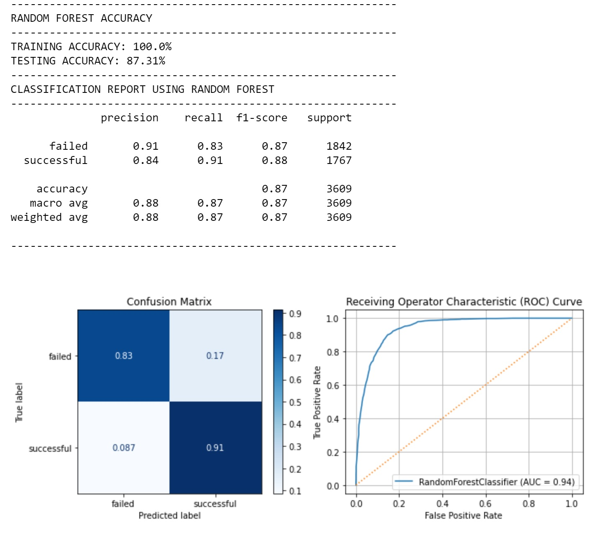
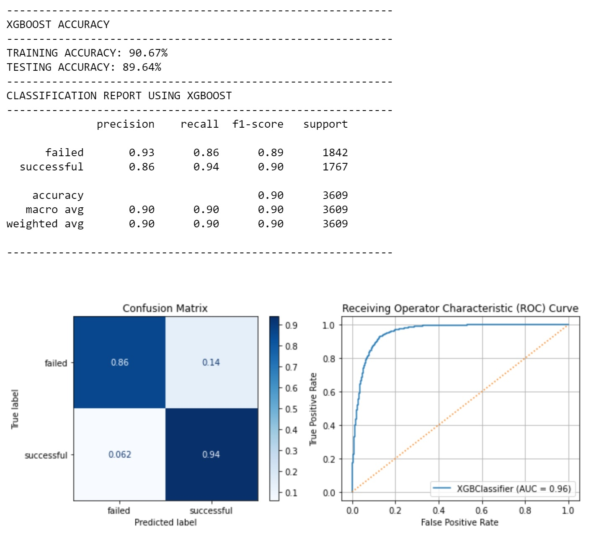
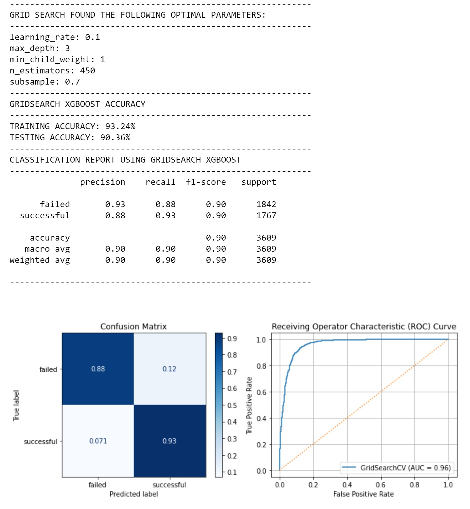
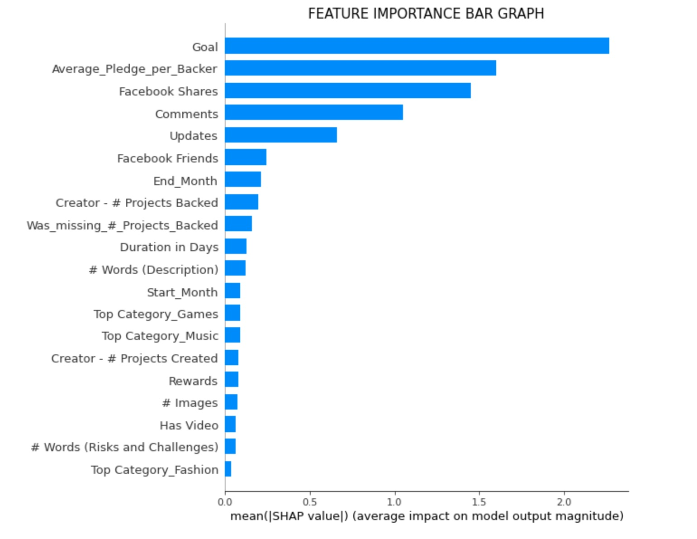
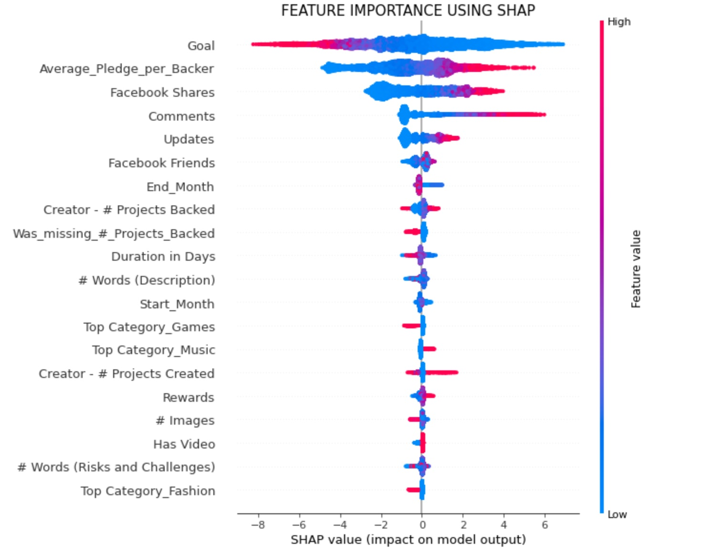
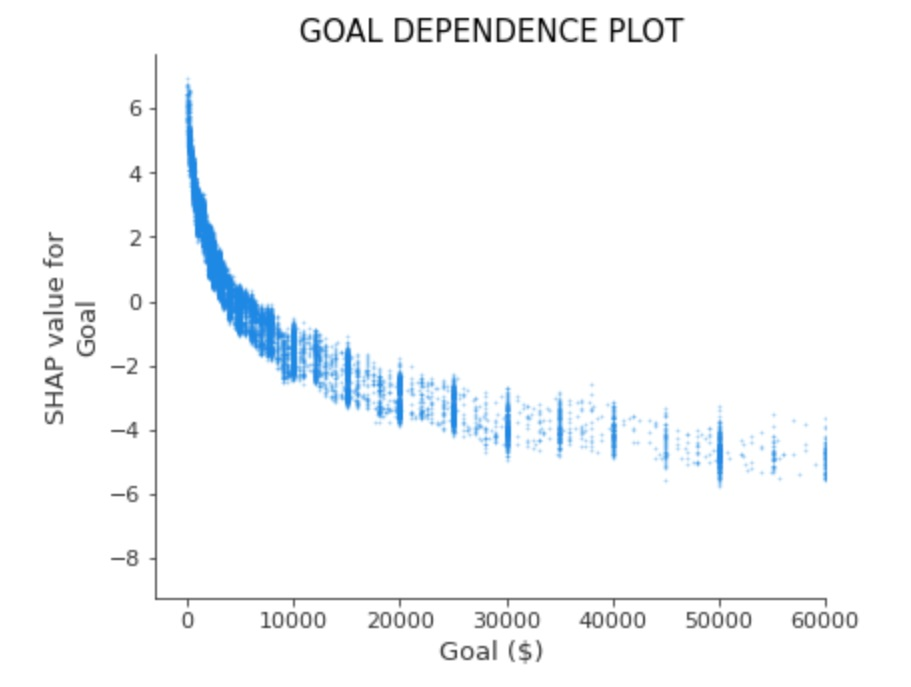
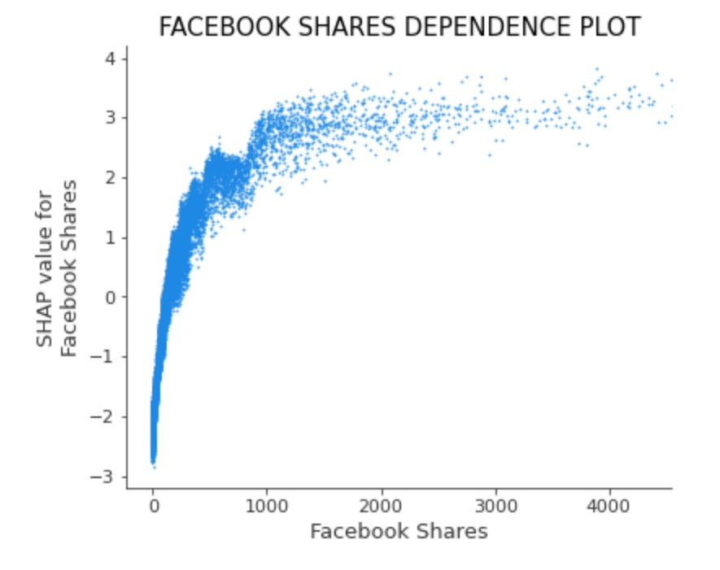
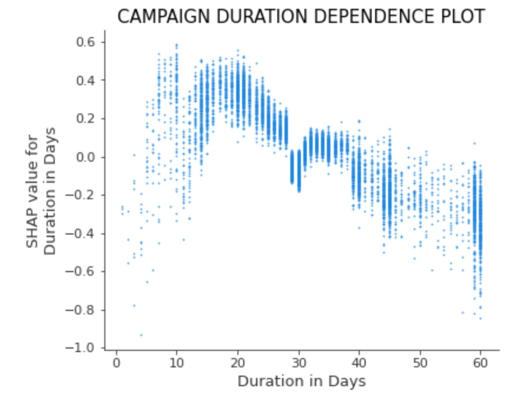

# Creating an effective campaign in Kickstarter
## Determining feature importance using XGBoost

**Author:** Gabriel J. Araujo

The contents of this repository detail an analysis of the Flatiron Data Science module 3 project. This analysis is detailed in hopes of making the work accessible and replicable.

### Business Problem:

Kickstarter is one of the most popular crowdfunding platforms in the market today, which has raised over $5 billion in pledges, successfully funded over 189,000 projects and has a 38.1% success rate.

The goal of this project is to create a model that can accurately predict if a startup will be successful and use the findings from that same model to assist new entrepreneurs by giving them pointers into what aspects of his/her business they should focus on.

### Data
The dataset being analyzed in this project is called "Kickstarter dataset" and was taken from www.kaggle.com/tayoaki/kickstarter-dataset.

This is a balanced dataset which consists of 18,142 observations and 35 unique features.

## Methods
### Analysis Framework

We will be using the OSEMN framework (outlined in brief below)

 #### Obtain
 
- Obtain Kickstarter dataset from Kaggle.com.

#### Scrub
 
- Remove unwanted features (Id, Name, Url, etc...).
- Filling null values.

#### Explore
 
- Feature engineer columns to maximize data usage.

#### Model
- Random Forests Classifier.
- XGBoost Classifier.
- GridSeach XGBoost Classifier.

#### Interpret
- Results.
-  Recommendations and Future Work.

## Results

### Vanilla Random Forest

- The vanilla Random Forest over-fitted the data, causing the training accuracy to be 100%, but the test accuracy wasn't too bad at 87.28%. What is really important in a classification model is the Receiving Operator Characteristic Curve, the higher the value, the better, with a 1.0 giving perfect predictions. For this Vanilla model, the ROC Curve is 0.94, which is pretty good as well. Let's try using a different model to see if that score can be improved.
### Vanilla XGBoost

- The vanilla XGBoost model did not over-fit the data like the Random Forest model.The training accuracy dropped to 90%, but the testing accuracy went up by 2.5%. The ROC Curve went up to 0.96 compared to 0.94. Let's try some hyperparameter tuning to see if the if we can make the model even better.

### Grid Search XGBoost

- Grid Search was able to find the optimal parameters for the model. The training and test accuracy improved slightly, but the ROC Curve remained at 0.96.

### Feature Importance

The plot above illustrates the top 20 important features in our model, with 'Goal' being the feature that was used the most to split the XGBoost tree. By looking at the graph itself, it is impossible to know the impact of the features.Goal could be the most important, but it's not known if beneficial to have a large or small goal. This is where the regular SHAP summary_plot comes in.

The SHAP summary plot can further show the positive and negative relationships of the predictors with the target variable. This plot is made of all the dots in the train data. It demonstrates the following information:

Feature importance: Variables are ranked in descending order.
Impact: The horizontal location shows whether the effect of that value is associated with a higher or lower prediction.
Original value: Color shows whether that variable is high (in red) or low (in blue) for that observation.
(Dr. Dataman - towardsdatascience.com)

### SHAP Feature Importance

The following conclusions can be taken from the plot above.

Things that increase a Startup's success rate:
- The more money an individual backer gives, the higher the chance of success.The number of individual backers isn't as important.
- The more marketing and social media exposure/involvement (Number of Facebook shares and comments) the better.
- High number of projects created. An experienced entrepreneur has a higher chance than an amateur.
- The more rewards the better.

Things that decrease a Startup's success rate:
- The higher the Goal, the lower the chance of a startup being successful.
- Long duration Campaigns.
- Campaigns that end close to the end of the year.
- Games and Fashion Categories.

### SHAP Dependence Plots

- After taking a closer look into the 'Goal Dependence Plot With Average_Pledge_per_Backer Interaction', it can be clearly seen how high goals negatively impacts the model's output. A good goal limit for a campaign is around $10,000.00.  

- This other Facebook Shares dependence plot shows how a large number of shares positively impacts the model's output. The number of Facebook Shares becomes relevant once it passes 500 shares.

- The Campaign Duration dependence plot shows the campaign duration being from 10-35 days, with long duration campaigns  not helping achieve large goals.

## Recommendations:

If you are a creator looking to start your own startup in Kickstarter, look for the following pointers:

- Set a small goal for your campaign. Historically, campaigns that had a small goal were more successful. Limit your goal to $10,000.
- The more marketing and social media exposure/involvement (Number of Facebook shares and comments) the better. The higher number of people who are exposed to your idea or product, the higher the chance to get individual to take an interest and invest in it.
- Focus on a niche and target that specific audience. Some campaigns are successful not because they had a big number of backers, but because those backers like and relate to the idea so much that they decided to invest a lot into it.
- Pick a campaign duration of between 10 to 35 days. Data shows that the success rate of campaigns with duration longer than 35 days drops drastically.
- Do not make your campaign's end date close to the end of the year. Success rate may tends to decrease during that time because people might be saving money for the holidays.
- Try to have a reward system. People might invest more money into your project if they get an 'immediate' return from it.
- Avoid Games and Fashion categories. Those markets might be too saturated, and your project might just fall through the cracks.
- Most importantly, do not give up on your first project/campaign, the more campaigns you do, the more you will learn from them and the higher will be your success rate on the next one.

## Limitations & Future Work

### Limitations
This project was limited by the low number of features in the dataset. The model could have been improved if the dataset contained features such as if the project was spotlighted, if it was a staff pick, and if it had any front page exposure.

### Future work include:
- More research into the reason behind the increased failure rate of long campaigns. Does the Kickstarter algorithm only focus on fresh projects?
- Research how front page exposure impacts a project's success.
- Determine the best reward system to have in a campaign. Is it better to have a discount tier, give brand merchandise and souvenirs, or give out product prototypes?
- Prove the end date hypothesis is correct.

### For further information
Please review the narrative of our analysis in [jupyter notebook](./main_notebook.ipynb) or review my [presentation](./presentation.pdf)

For any additional questions, please contact me at gabriel.jarosi.ar@gmail.com)

